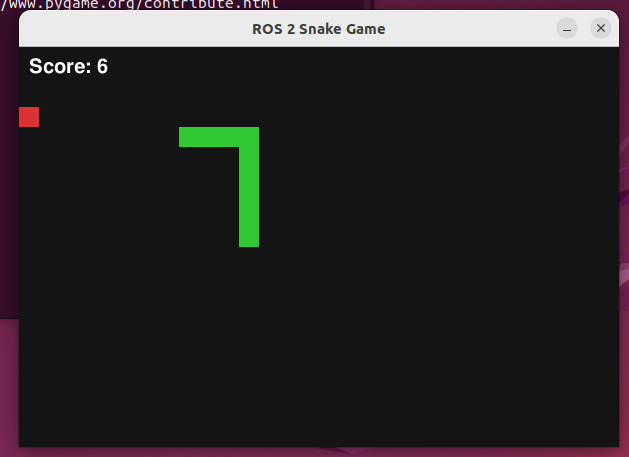
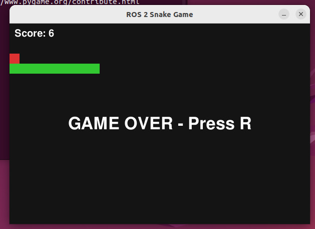
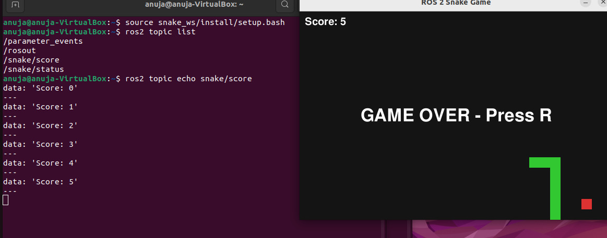

# ROS 2 Snake Game

A classic Snake game developed using **ROS 2, Python, and Pygame**.

The project demonstrates how ROS 2 can be integrated with a graphical Python application using ROS nodes and topic-based communication.

## Features

- Classic Snake gameplay
- Keyboard-based movement
- Food generation
- Score tracking
- Wall collision detection
- Self-collision detection
- Game-over detection
- Game restart functionality
- ROS 2 score publishing
- ROS 2 game-status publishing

## Technologies Used

- ROS 2 Humble
- Python 3
- Pygame
- `rclpy`
- `std_msgs`

## ROS 2 Architecture

```text
+----------------------+
|   Snake Game Node    |
|                      |
|  Game Logic          |
|  Keyboard Control    |
|  Collision Detection |
|  Score System        |
+----------+-----------+
           |
           | ROS 2 Topics
           |
     +-----+------+
     |            |
     v            v
/snake/score   /snake/status
```

## Project Demo

### Gameplay



### Game Over



### ROS 2 Topic Communication

The game publishes score and status information through ROS 2 topics.


